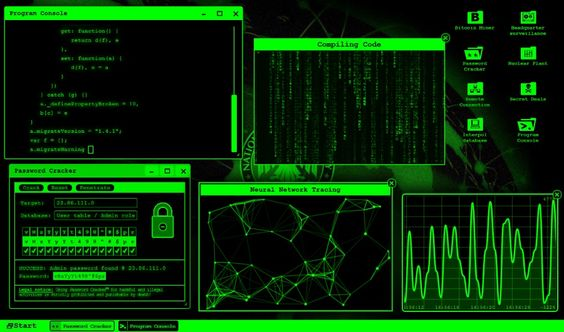

# Project BlueGorilla 



## Description


## Tools
    -1) Port scanner

## Setup

## Usage


## Contributing

### Roadmap

#### Trafic scanner
    
    Code a tool that scans and collects IP addresses and information of devices connected to a WiFi network.

    1) Use the net package to listen for network traffic on the WiFi interface in promiscuous mode. This allows you to capture all traffic, not just packets addressed to the device running the tool.
    2) As packets come in, parse the IP and MAC addresses from the frame headers to extract source and destination information. The net and net/packet packages can help parse packets.
    3) Use an ARP scanning technique to map IP addresses to MAC addresses. Send ARP requests asking "who has X.X.X.X" to map responses back to IPs.
    4) Parse DHCP requests to pull out assigned IP addresses, hostnames, and other device information broadcasted by clients.
    5) Parse HTTP headers, DNS requests, and other cleartext protocol data to gain additional details like OS, browser info, etc.
    6) Organize and store the extracted IP, MAC addresses, and device information into a database or other structured output.
    7) Provide options to filter and display the collected device data in a readable format for the user.
   
   The gopacket and bettercap libraries can also help with packet capture and analysis. Overall this project will teach you a lot about packet analysis, parsing, and tracking device state on a network!


   ### Design 
   Here is a Markdown document outlining the database design and architecture for the WiFi scanning tool:

# WiFi Scanning Tool Design

## Architecture

The tool will follow a modular architecture with the following components:

- **Main** - initializes packet capture, starts goroutine 
- **Packet Capture Engine** - captures packets from WiFi interface 
- **Packet Parsing Engine** - decodes packets, extracts device information
- **Database Updater** - stores device data into the database  
- **Display Engine** - provides interactive query interface

## Database Design

- Use SQLite for a self-contained, serverless database
- Main `devices` table to store device data:

```
IP (string) - primary key
MAC (string) - indexed 
Hostname (string)
OS (string) 
Browser (string)
First_seen (datetime) 
Last_seen (datetime)
```

- In-memory map with IP address as key for fast lookups
- Only store relevant packet snippets, limit memory usage
- Prune very old devices not seen for a threshold time

## Device Data Extraction 

- Parse Ethernet, IP, TCP/UDP headers for MAC/IP addresses 
- Extract IP and hostname from DHCP requests
- Parse HTTP user-agent, DNS queries for additional device info
- Focus on essential data needed for device fingerprinting

This covers the key aspects of the tool's design and implementation details. Let me know if you need any part clarified or expanded on!


## Disclaimer 

We do not condone or encourage any illegal activity. Use responsibly.

## License

This project is licensed under the WTFPL - see LICENSE.md for details